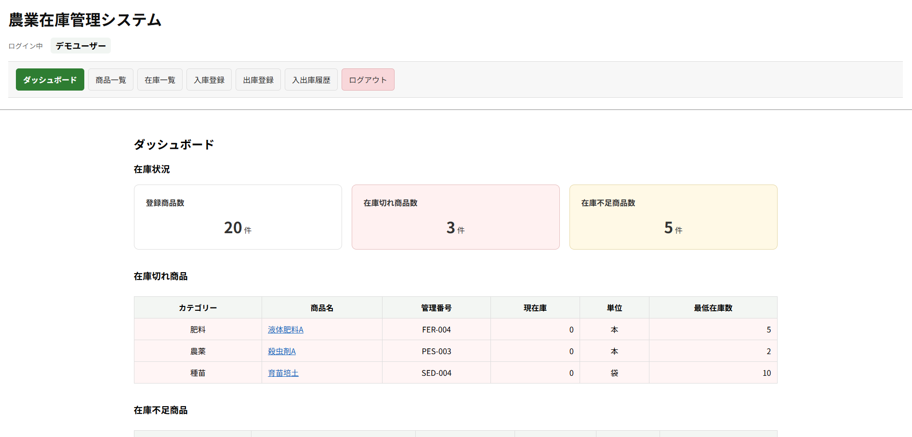
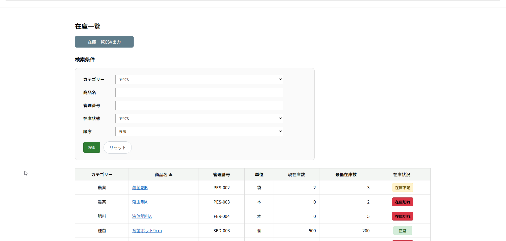
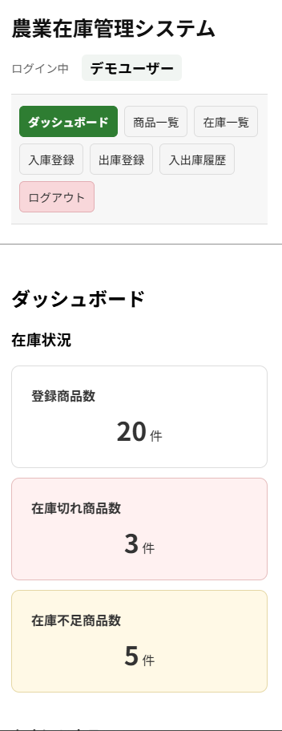

# 農業向け在庫管理システム

農業資材や商品の在庫を、シンプルな操作で管理するためのWebアプリケーションです。

個人農業者や小規模事業者での利用を想定し、
PCやスマートフォンの操作に不慣れな方でも使いやすいことを意識して制作しました。

商品の登録、入庫・出庫、現在庫の確認、入出庫履歴の記録など、
日常的な在庫管理に必要な基本機能をまとめています。

## デモ

公開URL：

https://agrilinker.site

デモユーザーでログインして、実際の操作を確認できます。

- メールアドレス：`demo@example.com`
- パスワード：ログイン画面に記載

※ デモ環境では、データ保護のため一部の操作を制限しています。

## 主な機能

- 商品管理
  - 商品の登録・編集・削除
  - カテゴリー管理
  - 管理番号（SKU）による管理

- 在庫管理
  - 入庫・出庫登録
  - 入出庫履歴から現在庫を自動計算
  - 最低在庫数の設定
  - 在庫状況（通常・在庫少・在庫切れ）の確認

- 検索・絞り込み
  - 商品名
  - 管理番号
  - カテゴリー
  - 在庫状況
  - 入出庫区分・期間

- 入出庫履歴
  - 全商品の入出庫履歴
  - 商品ごとの履歴
  - 操作者・操作日時・メモの記録
  - 過去の履歴を直接書き換えない訂正機能

- CSV
  - 商品データのインポート・エクスポート
  - 入出庫履歴のインポート・エクスポート

- その他
  - ログイン認証
  - ダッシュボード
  - PC・スマートフォン対応

## 画面イメージ

### ダッシュボード


### 在庫一覧


### スマートフォン表示


## 工夫した点

### 入出庫履歴を基準にした在庫管理

現在庫を直接更新するのではなく、入庫・出庫の操作を
`stock_logs` テーブルへ履歴として記録し、その合計から現在庫を算出しています。

在庫数だけを保持する方式では「なぜこの在庫数になったのか」を
後から確認しにくいため、履歴を基準とする設計にしました。

各履歴には商品、入出庫区分、数量、操作者、操作日時などを記録し、
在庫数の変化を後から確認できるようにしています。

### 入出庫履歴を残す訂正機能

登録済みの入出庫履歴を直接編集・削除すると、
過去にどのような操作が行われたのか分からなくなるため、
元の履歴を変更しない訂正方式を採用しています。

訂正時には元履歴と反対の入出庫区分・同じ数量の履歴を新しく作成し、
`corrected_log_id` によって元の履歴と関連付けています。

また、訂正理由を記録し、同じ履歴を二重に訂正できないよう制御しています。

これにより、誤入力を修正しながら、
「いつ、どの履歴が、なぜ訂正されたのか」を確認できるようにしました。

### 分かりやすい在庫状況表示

商品ごとに最低在庫数を設定し、
現在庫に応じて「通常」「在庫少」「在庫切れ」を確認できるようにしました。

在庫数そのものだけでなく、
補充が必要な商品を判断しやすいことを意識しています。

### PC・スマートフォンへの対応

個人農業者や小規模事業者での利用を想定し、
PCだけでなくスマートフォンからも主要な操作ができるよう、
レスポンシブ表示に対応しています。

## テスト

主要なバックエンド処理についてFeature Testを作成しています。

主なテスト対象：

- 商品の登録・編集・一覧・詳細・検索
- 入庫・出庫
- 現在庫への反映
- 入出庫履歴
- 履歴訂正
- デモユーザーの操作制限
- 在庫不足時の出庫制限

特に履歴訂正では、

- 元の履歴が変更されないこと
- 訂正履歴が新しく作成されること
- 入庫と出庫が反転すること
- 同じ履歴を二重に訂正できないこと

などを確認しています。

## 使用技術

### バックエンド
- PHP
- Laravel
- Laravel Fortify

### フロントエンド
- HTML
- CSS
- JavaScript

### データベース
- MySQL

### 開発・インフラ
- Docker / Docker Compose
- Nginx
- Ubuntu
- ConoHa VPS
- Git / GitHub

## 環境構築
### dockerビルド

1. リポジトリのクローン

   `git clone https://github.com/tomo1583gh/inventory-management.git`

2. 階層を変更

    `cd inventory-management`

3. Dockerコンテナのビルド・起動

    `docker compose up -d --build`

    ※  MySQLは、OSによって起動しない場合があるのでそれぞれのPCに合わせてdocker-compose.ymlファイルを編集して下さい。

    ※　Linux / WSL 環境で以下のような警告が出る場合は、「UID/GID の設定（Linux/WSL 推奨）」を参照してください。

```text
    WARN The "UID" variable is not set. Defaulting to a blank string.
    WARN The "GID" variable is not set. Defaulting to a blank string.
```    

### Laravelセットアップ

1. PHPコンテナに入る

    `docker compose exec php bash`

2. Composerで依存パッケージをインストール

    `composer install`

3. .envファイルを作成

    `cp .env.example .env`

    必要に応じて環境変数を編集

4. アプリケーションキーを生成

    `php artisan key:generate`

5. マイグレーションを実行

    `php artisan migrate`

6. 初期データを投入

    `php artisan db:seed`

7. Mailhog起動（別途インストール必要）

    http://localhost:8025 にアクセスし、送信メールを確認出来ます  
    `.env`のMAIL_HOST=mailhogを設定してください

8. ブラウザでアプリにアクセス

    `http://localhost`